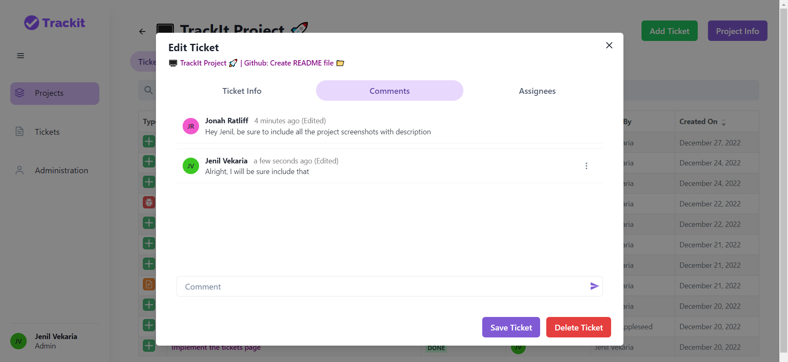
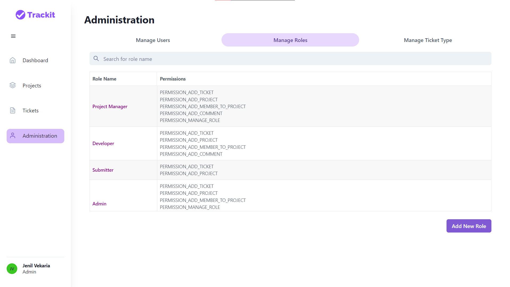

<!-- INTRO SECTION -->
<br />
<p align="center">
 

    
  </a>

  <h3 align="center">Issue and Project Tracking System</h3>

  <p align="center">
    Use Trackit! Tracking system that allows team members to collaborate, discuss and manage projects effectively 
    <br />
    <br />
  </p>
</p>

<!-- FEATURE SECTION -->

## ✨ Features

- Team management
- Project management
- Ticket management
- User assignment
- Statistics
- Searching
- Commenting
- Role based organization (Create custom permissions)
- Ticket Type field (Create custom ticket type)
- Attachments (Coming soon)
- Change tracker (Coming soon)

<!-- TECHNOLOGY SECTION -->

## 🛠️Technologies

| **Front-end** | <p align="center"><br/> React</p>                                                                                        | <p align="center"><br/>Chakra UI</p>                                                                | <p align="center"><br/>Axios</p>                                                          | <p align="center"><br/>Redux</p>      |
| ------------- | ------------------------------------------------------------------------------------------------------------------------------------------------------------------------------------------------------------------- | ---------------------------------------------------------------------------------------------------------------------------------------------------------------------------------------------------- | ---------------------------------------------------------------------------------------------------------------------------------------------------------------------- | ------------------------------------------------------------------------------------------------------------------------------------------------ |
| **Back-end**  | <p align="center"><br/>NodeJs</p> | <p align="center"><br/>ExpressJS</p> | <p align="center"><br/>MongoDB</p> | <p align="center"><br/>Jest</p> |

## 🚀 Quick start

Start developing locally.

### Step 1: Download Node.js and MongoDB

Download: [MongoDB](https://www.mongodb.com/try/download/community)
Download: [Node.js](https://nodejs.org/en/)

### Step 2: Clone the repo

Fork the repository then clone it locally by doing

```sh
git clone https://github.com/suryavdotcom/Trackit.git
```

### Step 2: Install Dependencies

cd into the client and server directory, and install the dependencies

```sh
cd client & npm install
```

```sh
cd server & npm install
```

### Step 3: Setup .env

To run the server you will also need to provide the `.env` variables

- create a new file <b>.env</b> in the root
- open [.env.EXAMPLE](./server/.env.EXAMPLE)
- copy the contents and paste it to the .env with valid keys

### Step 4: Seed database

Make the following POST request to seed the database (Only can run this in `development` or `testing` environment)

```sh
http://localhost:5000/test/populate
```

##### Login Info

| Email                        | Password | Role Type       |
| ---------------------------- | -------- | --------------- |
| james.smith@bugtracker.com   | password | Admin           |
| michael.smith@bugtracker.com | password | Developer       |
| robert.smith@bugtracker.com  | password | Project Manager |
| maria.garcia@bugtracker.com  | password | Submitter       |

#### You are all setup!

Run client application

```sh
npm start
```

Run server application

```sh
nodemon server.js
```

### Give a ⭐, if you liked the project

## 📸 Screenshots

<div>
  <h3>Login</h3>
  <p>Log into the application with your credentials. If you don't have an account, click <strong>Sign Up</strong> to create a new account. Once you have logged in, you will be directed to projects page</p>
 
</div>

<div>
  <h3>View All Projects</h3>
  <p>You will find all the projects you have created or belong to. You can also search and sort the projects. Click on <b>Add Project</b> to create new project</p>
  <em><b>If your permissions doesn't allow you to manage project, "Add Project" will not be displayed</b></em>
 
</div>

<div>
  <h3>Add Project</h3>
  <p>Enter your project information here (Title and description)</p>
  
</div>

<div>
  <h3>Add Project (Contributor)</h3>
  <p>Select all the project contributors. You will also see what type of role the user belong to.</p>

</div>

<div>
  <h3>View Project Info</h3>
  <p>Once you have created your project, you will see all your project tickets (intially none). You create new tickets, view project info and edit exisiting ticket.</p>
   <em><b>If your permissions doesn't allow you to manage tickets, "Add Ticket" will not be displayed</b></em>
  </div>

<div>
  <h3>Project Overview</h3>
  <p>Click on <b>Overview</b> to see the project statistics</p>

</div>

<div>
  <h3>View Ticket Info</h3>
  <p>Click on the existing ticket, you can edit the ticket info, add comment or update the ticket assignee</p>
  <em><b>If your permission doesn't allow you to manage tickets, all the fields, comments, assigness will be disabled</b></em>
 
</div>

<div>
  <h3>View Ticket Comments</h3>
  <p>Click on comments tab, you will see all the ticket comments and you can also comment on it.</p>
  <em><b>If your permission doesn't allow you to manage comments, you will not be able to comment</b></em>
  
</div>

<div>
  <h3>My Tickets</h3>
  <p>Click on <b>Tickets</b> tab to see all your tickets regarless of what project it belongs to. Clicking on the ticket will allow you to edit it</p>
 
</div>

<div>
  <h3>Admin - Manage Users</h3>
  <p>Click on <b>Admin</b> to manage the organization (Users, Roles, Custom Ticket Type)</p>
  <p>Click on <b>Manage User</b> to manage all the users and their roles. Clicking on the user will allow you to update their role</p>
  <em><b>This tab will only be displayed if you are the admin</b></em>
 
</div>

<div>
  <h3>Admin - Manage Roles</h3>
  <p>Manage Roles tab will display all the roles and their respective permissions. To create custom role, click on <b>Add New Role</b></p>
  
</div>

<div>
  <h3>Admin - Manage Roles (Add)</h3>
  <p>You can create your custom role by giving a role name and selecting the types of allowed actions</p>

</div>

<div>
  <h3>Admin - Manage Ticket Types</h3>
  <p>You will see all the ticket types here. There are some pre-defined ticket types (Feature, Bug, Documentation, Support), but you may create custom ticket types by clicking on <b>Add New Ticket Type</b></p>

</div>

<div>
  <h3>Admin - Manage Ticket Types (Add)</h3>
  <p>Create custom ticket type by giving ticket type name, selecting an icon, and the icon colour</p>


 
</div>
